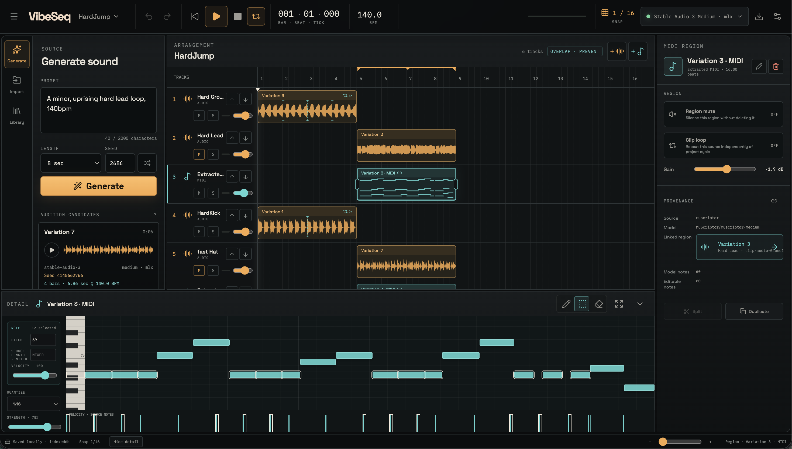

# VibeSeq

VibeSeq is an AI-assisted, local-first WebDAW built around one continuous loop:

`prompt → generate audio → place → extract MIDI → edit → arrange → play/export`

## Download and run

Download the ready-to-run desktop app from the
[VibeSeq v0.1.1 GitHub Release](https://github.com/acidsound/VibeSeq/releases/tag/v0.1.1).
Node.js, Python, and `uv` are not required.

- macOS Apple Silicon: open the `.dmg`.
- Windows x64: run the portable `.exe`.
- Linux x64: make the `.AppImage` executable and run it.

The executable does not contain model weights. On first launch VibeSeq offers
the correct Stable Audio download for the running OS after its terms are
accepted. MuScriptor Medium uses the same one-click flow on macOS, Windows, and
Linux after its CC BY-NC 4.0 license and upstream conditions are accepted.



*Generated audio and its linked MuScriptor Medium transcription arranged and
edited together in the VibeSeq Studio.*

The current repository contains a working Studio, a local inference service, and
a separate Colab T4 launcher. The default `procedural-demo` and `signal-demo`
providers are deterministic workflow fixtures. They produce real WAV/MIDI files
but are not Stable Audio 3 or MuScriptor, and the UI/provenance always says so.

## Build Week collaboration with Codex and GPT-5.6

VibeSeq was designed, implemented, tested, packaged, and prepared for submission
in an iterative maker-and-Codex workflow. The submission-period code history is
explicit: `c9ec1e6` records the initial Studio implementation on July 16, 2026;
`21f91cd` adds the native desktop release pipeline; `363c12a` integrates the
packaged runtimes and local storage contract; and `dd34a4f` refines the filmed
arrangement workflow. Later commits retain the same dated boundary. If an idea
or experiment predates that boundary, it is not presented as evaluated
Build Week implementation work.

Codex and GPT-5.6 accelerated four concrete parts of the project:

- researched musician workflows and translated them into the interaction and
  production contracts under `docs/product/`;
- turned one English UI brief into two distinct desktop/mobile directions in
  `docs/design/candidates/`, compared their usability, selected Candidate A,
  and recorded the reasons in `docs/design/visual-language.md`;
- implemented and tested the local-first Audio/MIDI editor, persistence,
  playback/export, real-model adapters, desktop packaging, and regression
  coverage, while the maker made the product and musical decisions;
- built the reproducible submission-video pipeline in `promo/`, including real
  packaged-app capture, E-minor/120 BPM source generation, exact narration
  placement, beat-aligned cumulative mixing, functional camera moves, and
  automated audiovisual QA.

The maker retained the consequential decisions: the `Apps for Your Life`
positioning, arrangement-first UX, local-first boundary,
model/license constraints, E natural minor and 120 BPM music contract, one-time
wordless vocal peak, bass timing, and every listening/visual approval. Codex
produced the options, selected the more user-friendly UX candidate, implemented
and tested it, and assembled the evidence; it did not set the product purpose,
musical direction, or license boundaries. Timestamped Codex
session evidence and the required `/feedback` session ID accompany the Devpost
submission.

## Start the verified local slice

Node 24 is pinned in `.nvmrc`.

```sh
nvm use
npm ci
./scripts/run-inference.sh
```

In a second shell:

```sh
npm run dev
```

Open the URL printed by Vite. The inference service persists jobs and assets in
the platform user-data directory; the Studio persists the project and source
blobs in IndexedDB, with a localStorage fallback. Memory can retain the current
browser session only; it never satisfies a durability barrier or displays
`Saved locally`.
The checkpoint format, interrupted-save journal, recovery API, and migration
rules are documented in `docs/product/persistence-recovery.md`.

Tempo and generation-seed fields use draft editing: typing does not mutate the
project or submit a new seed. Press Enter or leave the field to commit; press
Escape to restore the committed value. A committed tempo change is one undoable
project command. The generation seed is stored with the job, candidate, placed
asset/clip provenance, checkpoint, and portable project bundle.

Placed Audio keeps an explicit timebase. Seconds-based generation and imported
SFX use `fixed-seconds`: a tempo edit preserves source speed and seconds while
rebasing beat geometry. Bar-based generation uses `tempo-follow-repitch`: beat
length stays musical and playback follows tempo with an honestly labelled
varispeed/repitch ratio. Pitch-preserving stretch is not claimed. A tempo edit
is rejected as one atomic command if rebasing fixed-time regions would violate
the non-overlap policy.

## Current Studio workflow

The current implementation has the following source-wired behavior. The newest
integration is awaiting one batched full Playwright revalidation, so this list
is an implementation inventory rather than release evidence:

- `Add track` creates an independent Audio or MIDI track. Track headers keep
  direct Move up/Move down controls; there is no track overflow menu.
- Selecting a track opens Track properties (the right Inspector on desktop and
  the selected-track Inspector surface on mobile). Its track identity row keeps
  Edit and Delete adjacent. Edit replaces the displayed name with an in-place
  input: Enter or focus-out commits one undoable change, and Escape restores the
  committed name. Delete removes the track's regions and MIDI routing in one
  undoable command; Undo restores the complete track.
- `Place at playhead` targets the selected Audio track. A selected MIDI track or
  an occupied target range is rejected with a named reason instead of silently
  rerouting the sound. With no selected track, placement creates an Audio track.
- Generate, Import, and Library share the source surface. The IndexedDB-backed
  Library stores generated sounds across local projects and supports search,
  audition, placement, download, and explicit deletion.
- A selected Audio region can run tempo detection on decoded PCM in a Worker
  and apply one of the reported BPM candidates through the normal atomic tempo
  command. Audio Detail uses the decoded clip waveform as a pointer/keyboard
  seek surface, and its fade-in/fade-out handles edit the persisted clip
  parameters instead of acting as decoration. The Detail editor can collapse
  and reopen without clearing its parent region selection.
- MIDI Detail represents the complete `0..127` pitch range as fixed 12 px rows.
  Expanding the editor increases the visible pitch range without stretching
  notes; the piano keyboard and note grid share one vertical scroll viewport,
  and black keys are offset upward by half their rendered height. Selecting a
  note or pressing a piano key auditions that pitch through the selected
  track's current TinySynth or Chaos routing profile.
- The normal playback backend is `AudioWorklet`. Mixer messages do not rebuild
  the audio graph, and page re-entry recreates and resynchronizes a closed owned
  audio context. MIDI-track properties choose channel, General MIDI program,
  and either TinySynth melodic playback or the compact Chaos drum profile fixed
  to MIDI channel 10.

The Project menu can export a self-contained `.vibeseq` bundle containing the
arrangement, project jobs, unplaced generation candidates, active job snapshot,
and encoded source media. Import validates the schema and SHA-256 identity of
every embedded asset before atomically changing the open project. This is the
supported editable-project transfer path between the desktop and Colab Studio
targets; WAV and MIDI remain rendered deliverables rather than project backups.
WAV export supports the full arrangement, the active loop range, direct
per-track renders, and one ZIP containing every individual track plus a render
manifest. Individual track files retain arrangement alignment from project
time zero through the project end and render Audio or MIDI tracks in isolation
with their gain, pan, clips, fades, instrument, and master gain. The bulk path
decodes source PCM once, then renders and packages all stems in a background
Worker.
If durable browser storage is unavailable, the persistent warning offers a
`-recovery.vibeseq` emergency bundle from the latest coherent in-memory state;
that export does not clear the warning or claim a successful local save.

If the default inference port is occupied, use matching overrides:

```sh
VIBESEQ_PORT=8788 ./scripts/run-inference.sh
VIBESEQ_INFERENCE_URL=http://127.0.0.1:8788 npm run dev
```

## Enable real model adapters

First accept the upstream model terms and authenticate with Hugging Face. Then
copy the credential template and add `HF_TOKEN` locally:

```sh
cp .env.example .env
```

`scripts/run-inference.sh` and `scripts/run-inference.ps1` pass `.env` to
Uvicorn's data-only parser; they never source or execute it. An already exported
environment variable takes precedence over the file. The token stays in the
inference process and is never exposed to Vite or browser code.

Install the model extras and select the explicit providers:

```sh
VIBESEQ_INSTALL_MODELS=1 \
VIBESEQ_GENERATION_PROVIDER=stable-audio-3 \
VIBESEQ_TRANSCRIPTION_PROVIDER=muscriptor \
./scripts/run-inference.sh
```

Both real providers are fixed to `medium`. Supplying a small-model override is a
configuration error; a failed real adapter is reported as a failed job and is
never replaced by a small or demo provider. Stable Audio uses explicit runtime
routes: official MLX weights on Apple Silicon, PyTorch + FlashAttention 2 on
Ampere-or-newer CUDA, a provisional SDPA route on T4, and the verified official
TFLite medium route for CPU fallback. The CPU route is pinned to `w8a8-dyn`
medium DiT + SAME-L rather than substituting a small model. Routes without a
verified VibeSeq adapter report `ready=false` instead of pretending to work.
MuScriptor prefers CUDA, then MPS,
then CPU with its pinned PyTorch medium checkpoint. See `server/README.md` for
the exact revisions and readiness fields.

To exercise the desktop CPU fallback even on a machine with a usable GPU, add
`VIBESEQ_FORCE_CPU=1`. This is valid only for `VIBESEQ_TARGET=local`; health
then reports `forceCpu=true` and CPU-only selected routes. It never selects a
remote service or a smaller/demo model.

Review the upstream licenses before production or commercial use:

- Stable Audio 3: <https://github.com/Stability-AI/stable-audio-3>
- MuScriptor: <https://github.com/muscriptor/muscriptor>

## Desktop release packages

Release tags matching `v*` build an unsigned Windows x64 assisted installer and
unsigned Apple Silicon macOS and Linux packages through GitHub Actions. These packages
embed the Studio and lightweight local inference sidecar, so the target machine
does not need Node.js, Python, `uv`, or a separate web server.

The desktop sidecar includes the real Stable Audio 3 MLX runtime, MuScriptor,
PyTorch, and their pinned execution code, but no model weights. The Inference
readiness panel installs the digest-pinned Stable Audio and MuScriptor Release
assets into the exact model-cache path reported by the running package.

- Stable Audio 3 Medium optimized:
  <https://huggingface.co/stabilityai/stable-audio-3-optimized>
- MuScriptor Medium:
  <https://huggingface.co/MuScriptor/muscriptor-medium>

See `docs/product/desktop-release.md` for artifact names, model paths,
security boundaries, unsigned-build warnings, and the clean-Windows acceptance
checklist.

Windows builds keep `VibeSeq Data` beside the installed `VibeSeq.exe`; macOS
builds default to `~/VibeSeq Data`. Set `VIBESEQ_HOME` before launch to place the
complete profile, model, runtime, project, Library, and inference tree on
another volume.

## Colab T4 target

Colab runs the complete built Studio and inference API from one origin; it is not
a hidden fallback for the desktop target.

Add `HF_TOKEN` to the notebook's Colab Secrets panel and grant the notebook
access. Do not upload the local `.env` file. The notebook falls back to an
interactive Hugging Face login when the secret is absent. `COLAB_API_KEY` is
currently reserved and is not consumed by this manual notebook target.

```sh
python -m pip install uv
uv sync --project server --extra models
python colab/run_studio.py --repo .
```

The model contract remains medium-only on T4. Because standard FlashAttention 2
does not support Turing, Stable Audio uses the upstream SDPA/chunked path as an
explicitly provisional route; it must not downgrade to `small-music`. See
`colab/README.md` and `colab/VibeSeq_T4.ipynb` for the deployment gate.
The actual T4 run is intentionally deferred for the current milestone and is
still unverified; launcher/readiness tests are not deployment evidence.

## Product and design source of truth

- `docs/product/behavioral-baseline.md` — official Ableton Live and BandLab
  research translated into behavioral rules
- `docs/product/interaction-model.md` — object model, selection, panels, and
  desktop/mobile adaptation
- `docs/design/visual-language.md` — visual system and ImageGen candidate choice
- `docs/product/production-criteria.md` — release gates; a polished fixture is
  explicitly insufficient
- `docs/product/persistence-recovery.md` — checkpoint contents, two-phase local
  journal, explicit recovery, and schema migration contract
- `docs/product/midi-audio-runtime.md` — AudioWorklet boundary, MIDI routing,
  built-in TinySynth/Chaos rendering, and honest runtime limits
- `docs/product/verified-slice.md` — what has actually passed and what remains

The dated Apple-GPU evidence, retained browser recording/HAR, three consecutive
real-model browser workflows, and independently validated project/WAV/MIDI
exports are stored under `artifacts/qa/2026-07-15-real-medium/`. The three
forced-CPU browser workflows, their validated exports, and API job timing
samples are under `artifacts/qa/2026-07-15-real-medium-cpu-browser/`. Core
capacity evidence is under `artifacts/qa/2026-07-15-capacity/`. These are
joined by stereo-pan parity evidence under
`artifacts/qa/2026-07-15-audio-integrity/` and quota-recovery evidence under
`artifacts/qa/2026-07-15-persistence-recovery/`. These are
evidence sets, not a production-ready claim; small timing samples are not p50 or
p95 measurements.

## Checks

```sh
npm run check

cd server
uv run --extra dev pytest
uv run --extra dev ruff check .
uv run --extra dev ruff format --check .
```

The current conclusion is recorded in `docs/product/verified-slice.md`:
**production gate not yet passed**. Local real-Medium evidence now exists, but
commercial MuScriptor use still requires a separate license. The local Apple
GPU and forced-CPU core workflows each completed three consecutive times, but
immutable build provenance, the CPU network capture,
multi-browser/physical-device/screen-reader coverage, latency percentiles,
60-minute soak, ground-truth transcription, the full edit/render matrix, and
the eight-musician acceptance study remain open. The current track, Library,
tempo-analysis, Detail seek/fade/piano-roll, MIDI-audition routing, and
AudioWorklet integration also awaits the next batched full Playwright run.
Actual Colab T4 execution is a separate deferred deployment target outside the
current milestone.
